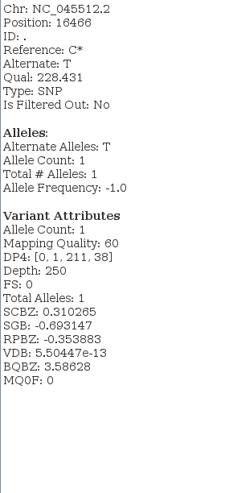

# Week 10

## Variant Calling Format

I used again the viral genome I am using for all weeks.

I downloaded the following SRR:

```
https://www.ncbi.nlm.nih.gov/sra/SRR15829420
```

It's Whole Genome Sequencing of SARS COVID-2 using Illumina MiniSeq reads.

The bioproject is the following:
```
PRJNA741723
```

The sample is the Delta variant in Bangladeshi sample.


We will align this to the reference genome of SARS COVID-2 with the following accession ID:

NC_045512.2

## Introduction

This Makefile combines read simulation, downloading, trimming, and quality control into a single pipeline. It uses `fastp` for trimming reads and `FastQC` for quality checks, and summarizes the results with `MultiQC`.
The reference genome for SARS COVID-2 is the following:

```
NC_045512.2
```

For information about the taxonomy can be found here:

[link](https://www.ncbi.nlm.nih.gov/Taxonomy/Browser/wwwtax.cgi?id=2697049)

This is a special viral genome which we can download with:

```
datasets download virus genome accession ${ACC}
```

Using the Makefile from the previous week I created a file:

```
align.bam
```

#### Variant Calling 

I added the following two commands in my Makefile:

```
call_variants:
	bcftools mpileup -Ov -f $(REF) $(BAM) > genotypes.vcf

call_variants_from_genotypes:
	bcftools call -mv -Ov --ploidy 1 genotypes.vcf > observed-mutations.vcf
```

To find the variants from the aligned bam file. The viral genomes are obviously ploidy=1.

If you see any mistakes please correct me. :)

Then, I used the observed-mutations to produce the results of the next section.

#### Results

In total I find 42 mutations:

```
grep -v '^#' observed-mutations.vcf | wc -l
```

I loaded the observed mutations vcf file alongside aligned bam file in IGV. I attach the following pictures:

For instance, let's zoom in the following region that we fetch from our vcf file:

```
cat observed-mutations.vcf | grep -a '164'    
NC_045512.2	16466	.	C	T	228.431	.	DP=250;VDB=5.50447e-13;SGB=-0.693147;RPBZ=-0.353883;BQBZ=3.58628;SCBZ=0.310265;FS=0;MQ0F=0;AC=1;AN=1;DP4=0,1,211,38;MQ=60	GT:PL	1:255,0
```

We can see this mutation in IGV indicated as blue. Blue means homozygous but in viral genomes it doesn't make any difference.


Furthermore, we can check the mutation box:



Indeed, we can see that we have a SNP from C (reference) to T (called variant).

By using

```
bcftools stats observed-mutations.vcf
```

we obtain the following table with transition counts for substitutions:

```
# ST, Substitution types:
# ST	[2]id	[3]type	[4]count
ST	0	A>C	0
ST	0	A>G	3
ST	0	A>T	1
ST	0	C>A	2
ST	0	C>G	2
ST	0	C>T	18
ST	0	G>A	4
ST	0	G>C	0
ST	0	G>T	5
ST	0	T>A	0
ST	0	T>C	4
ST	0	T>G	1
```

We can see that the most prevalent substitution is the C>T, which appears 18 times in total.

We can also visualize in IGV the aligned reads from the bam file, and see the variant:


In this example, all reads have the substitution C>T.

#### Potential false positives

For purposes of demonstration, we will assume that a false positive may arise with Quality 
less than 210 or the number of reads that support the variant to be less than 70.

Using the following command:

```
bcftools filter -i 'QUAL<210 || DP <70' observed-mutations.vcf | grep -v '^#'
```

Please note that the boundaries are purely artificial and are only chosen for demonstration purposes. 

In fact, it requires much lower Phred score and less number of reads supporting the variant than those defined above to actually 
indicate a putative false positive. Under these assumptions we proceed with our analysis.

We find that the following two substitutions may actually be false positives:

```
NC_045512.2	28249	.	A	T	12.5329	PASS	DP=39;VDB=3.75937e-20;SGB=-0.693136;RPBZ=-4.1833;BQBZ=-1.83488;FS=0;MQ0F=0;AC=1;AN=1;DP4=1,1,35,0;MQ=60	GT:PL	1:39,0
NC_045512.2	28253	.	C	A	98.894	PASS	DP=67;VDB=1.80025e-41;SGB=-0.693147;RPBZ=5.63781;BQBZ=-4.74268;FS=0;MQ0F=0;AC=1;AN=1;DP4=2,10,36,15;MQ=60	GT:PL	1:218,92
```
