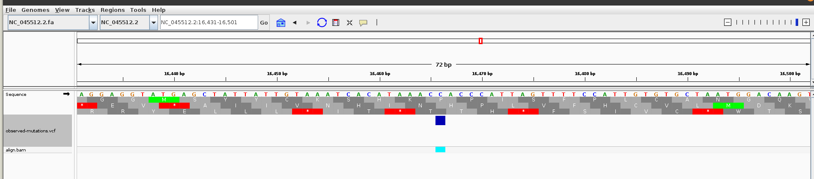
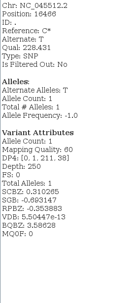
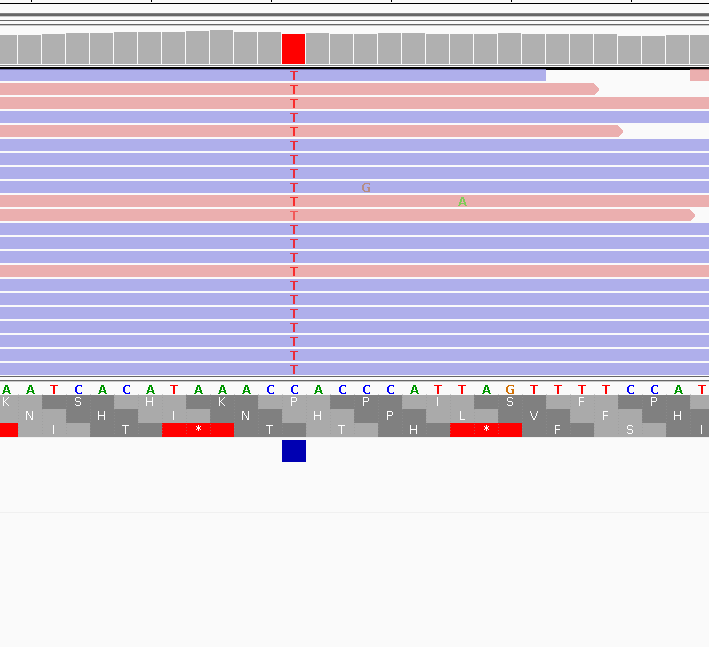
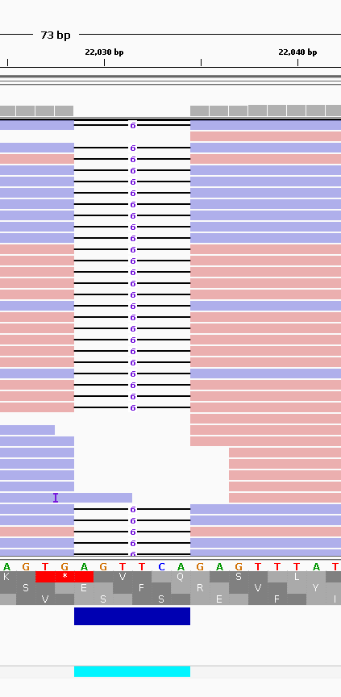
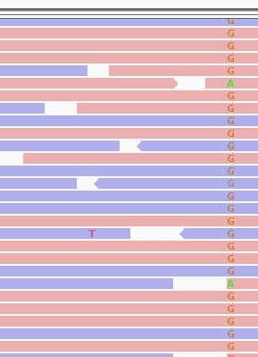
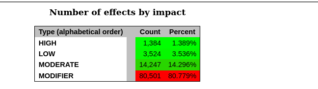
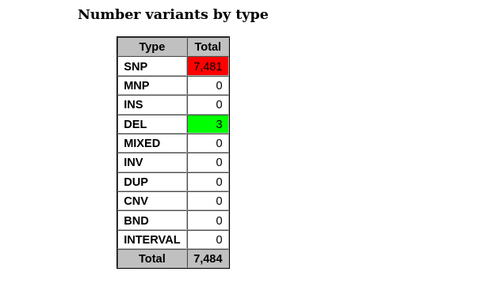
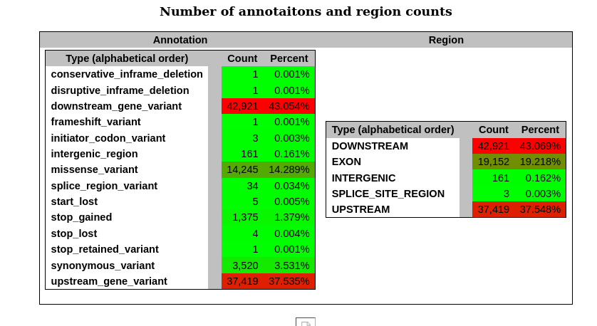

# Week 10

## Variant Calling Format

I used again the viral genome I am using for all weeks.

I downloaded the following SRR:

```
https://www.ncbi.nlm.nih.gov/sra/SRR15829420
```

It's Whole Genome Sequencing of SARS COVID-2 using Illumina MiniSeq reads.

The bioproject is the following:
```
PRJNA741723
```

The sample is the Delta variant in Bangladeshi sample.


We will align this to the reference genome of SARS COVID-2 with the following accession ID:

NC_045512.2

## Introduction

This Makefile combines read simulation, downloading, trimming, and quality control into a single pipeline. It uses `fastp` for trimming reads and `FastQC` for quality checks, and summarizes the results with `MultiQC`.
The reference genome for SARS COVID-2 is the following:

```
NC_045512.2
```

For information about the taxonomy can be found here:

[link](images/https://www.ncbi.nlm.nih.gov/Taxonomy/Browser/wwwtax.cgi?id=2697049)

This is a special viral genome which we can download with:

```
datasets download virus genome accession ${ACC}
```

Using the Makefile from the previous week I created a file:

```
align.bam
```

#### Variant Calling 

I added the following two commands in my Makefile:

```
call_variants:
	bcftools mpileup -Ov -f $(REF) $(BAM) > genotypes.vcf

call_variants_from_genotypes:
	bcftools call -mv -Ov --ploidy 1 genotypes.vcf > observed-mutations.vcf
```

To find the variants from the aligned bam file. The viral genomes are obviously ploidy=1.

If you see any mistakes please correct me. :)

Then, I used the observed-mutations to produce the results of the next section.

#### Results

In total I find 42 mutations:

```
grep -v '^#' observed-mutations.vcf | wc -l
```

I loaded the observed mutations vcf file alongside aligned bam file in IGV. I attach the following pictures:

For instance, let's zoom in the following region that we fetch from our vcf file:

```
cat observed-mutations.vcf | grep -a '164'    
NC_045512.2	16466	.	C	T	228.431	.	DP=250;VDB=5.50447e-13;SGB=-0.693147;RPBZ=-0.353883;BQBZ=3.58628;SCBZ=0.310265;FS=0;MQ0F=0;AC=1;AN=1;DP4=0,1,211,38;MQ=60	GT:PL	1:255,0
```

We can see this mutation in IGV indicated as blue. Blue means homozygous but in viral genomes it doesn't make any difference.



Furthermore, we can check the mutation box:



Indeed, we can see that we have a SNP from C (reference) to T (called variant).

By using

```
bcftools stats observed-mutations.vcf
```

we obtain the following table with transition counts for substitutions:

```
# ST, Substitution types:
# ST	[2]id	[3]type	[4]count
ST	0	A>C	0
ST	0	A>G	3
ST	0	A>T	1
ST	0	C>A	2
ST	0	C>G	2
ST	0	C>T	18
ST	0	G>A	4
ST	0	G>C	0
ST	0	G>T	5
ST	0	T>A	0
ST	0	T>C	4
ST	0	T>G	1
```

We can see that the most prevalent substitution is the C>T, which appears 18 times in total.

We can also visualize in IGV the aligned reads from the bam file, and see the variant:



In this example, all reads have the substitution C>T.

#### See some Indels??

Interestingly, we can see that some deletions have been called (in fact 2 deletions):

```
grep -a 'INDEL' observed-mutations.vcf
```

```
##INFO=<ID=INDEL,Number=0,Type=Flag,Description="Indicates that the variant is an INDEL.">
NC_045512.2	22028	.	GAGTTCA	G	228.42	.	INDEL;IDV=195;IMF=0.924171;DP=211;VDB=1.67476e-06;SGB=-0.693147;RPBZ=-6.64783;MQBZ=-0.498507;MQSBZ=1.35672;SCBZ=-7.35025;FS=0;MQ0F=0;AC=1;AN=1;DP4=4,2,125,70;MQ=59	GT:PL	1:255,0
NC_045512.2	28247	.	AGATTTC	A	228.418	.	INDEL;IDV=185;IMF=0.864486;DP=214;VDB=1.33163e-10;SGB=-0.693147;RPBZ=-6.76484;MQBZ=-0.395925;MQSBZ=0.48795;SCBZ=-9.43179;FS=0;MQ0F=0;AC=1;AN=1;DP4=4,2,153,29;MQ=59	GT:PL	1:255,0
```

We will visualize 22028. We can see that:

```
Chr: NC_045512.2
Position: 22028-22034
ID: .
Reference: GAGTTCA*
Alternate: G
Qual: 228.42
Type: INDEL
Is Filtered Out: No
```

and



This deletion also causes a frameshift!


#### Potential false positives

For purposes of demonstration, we will assume that a false positive may arise with Quality 
less than 210 or the number of reads that support the variant to be less than 70.

Using the following command:

```
bcftools filter -i 'QUAL<210 || DP <70' observed-mutations.vcf | grep -v '^#'
```

Please note that the boundaries are purely artificial and are only chosen for demonstration purposes. 

In fact, it requires much lower Phred score and less number of reads supporting the variant than those defined above to actually 
indicate a putative false positive. Under these assumptions we proceed with our analysis.

We find that the following two substitutions may actually be false positives:

```
NC_045512.2	28249	.	A	T	12.5329	PASS	DP=39;VDB=3.75937e-20;SGB=-0.693136;RPBZ=-4.1833;BQBZ=-1.83488;FS=0;MQ0F=0;AC=1;AN=1;DP4=1,1,35,0;MQ=60	GT:PL	1:39,0
NC_045512.2	28253	.	C	A	98.894	PASS	DP=67;VDB=1.80025e-41;SGB=-0.693147;RPBZ=5.63781;BQBZ=-4.74268;FS=0;MQ0F=0;AC=1;AN=1;DP4=2,10,36,15;MQ=60	GT:PL	1:218,92
```

As far as false negatives, it is not the case, but it could be the case that few reads have it but it's not actually called:





#### Annotation with SNPEFF

I am not sure what I did. Please provide insights =)

For consistency, I upload the COVID listing database I downloaded with snpeff tool, as
well as the markdown report generated by the snpeff and the genes. You can find them 
in the data directory.

But be warned traveller. I must warn you that I limited the read coverage due to limitations on my computer.
Hence the results of the previous section will not be on par with what follows.
Do not expect to find any positive traits of a proper scientific endevour in these pages.
Only chaos and doom lurks in what is to follow.

Having stated the potential cognitive dangers of crossing this bioinformatics report 
of cunniness and dark magic.

After succesfully installing the snpeff software, I added to the Makefile the following commands:

```
snpeff:
	@mkdir -p snpeff_refs/
	snpeff download $(SNPEFF_DB)
	snpeff -v $(SNPEFF_DB) $(VCF)/genotypes.vcf > snpeff_$(REF).vcf
```

I restructured the Makefile and made some quality changes like Istvan suggested.
For instance, I added new directory for VCF outputs.


I attach below the images displaying the data I retrieved from snpeff.
Although, I must admit it was very insightful. I was expecting more information.
I got general statistics about the variants but nothing insightful about the potential 
molecular mechanism changes induced by the mutations.

Perhaps, I expected too much after all =)







To summarize. The vast majority of the limited amount of short reads I downloaded 
as Substitution events. In fact, we counted 7,481 substitution events in total and 3 deletions.

It also reports that 80.78% of these variants are modifiers (?)

Most substitutions appear to be missense (74.40%), thus synonymous mutations. 
A 7.20% appears to be non-synonymous mutations.

The most common substitution events appear to be either from A>T or T>A. 
Also, a non-negligible amount of C>A and its reverse complement G>T is reported.

Furthermore, I can see many times in the amino acid table, that amino acids changed to stop codon, 
but I am not sure if these are genic areas?

That's all for now. I might come back to this report to test a different organism.

Insofar, COVID was being proven to be quite spooky and inconsistent, or at least 
the short reads I downloaded don't appear to be correct even though quality is not bad.

Make sure to test the Makefile and report any errors.

Thank you <3

Nikol

#### The End!

Thank you <3
