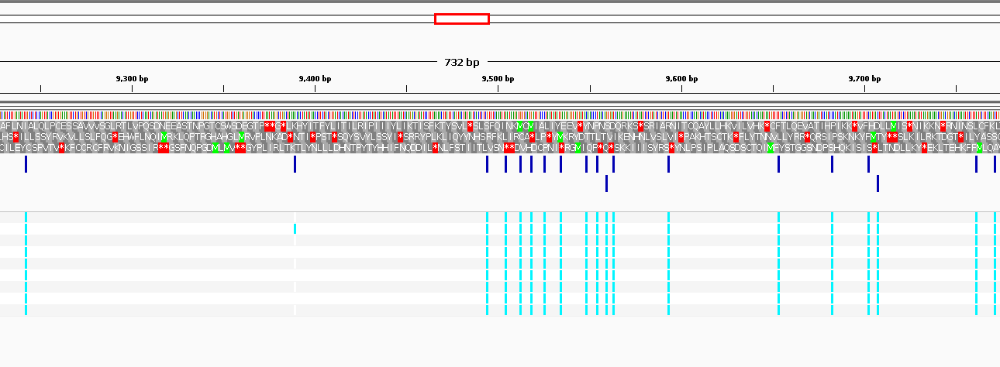

# Week 12


## Variant Calling Format


For a change I decided to use ebola viral genome: NC_002549.1

The bioproject PRJNA257197 to download the short reads (in fact the first 5).

I have developed the following scripts:

- pipeline.mk
- Makefile
- process_reads.sh

The pipeline.mk is a Makefile which isolates the processing of a single run from SRA with a pre-specified coverage depth.
When pipeline.mk exits succesfully, we will have computed a VCF file for the specified SRA run accession.

The process_reads.sh is bash script which utilises parallel command to submit multiple pipelines that calculate the VCF files
for all the given reads. The bash scripts receives a JOBS parameter to limit the number of parallel job submissions. 
Furthermoore, the first argument is the design.csv file which has the following structure:

```
run_accession,sample,coverage
```

The coverage parameter was used in case the user wants to specify small coverage. In my case, I used N=50000, 
so my computer can accomodate the computational requirements of the workflow.

Why did I choose to make the process_reads.sh bash script instead of integrating in the final Makefile.
No reason really. You can do that. I just like to break down everything in multiple pieces because it works better 
with my brain.

The final Makefile is the orchestrator. It uses bio to create the design.csv file from the given Ebola accession. In fact, you can
run:

```
make create_design
```

to automatically produce the design.csv file that process_reads.sh script uses as input. 
Additionally, by running 

```
make all
```

it triggers the following chain of events:

- Downloads specified reference genome using the `make genome` rule.
- Processes in parallel each SRA run accession using the `make process_reads` rule.
- It merges the generated VCF files from the previous rule using the `make merge` rule.

Additionally, there is a `make clean` to clean the directory from all the generated directories.

After the Makefile has run succesfully, inside the vcf/ directory, there will be a merged.vcf.gz file, 
which is the final output of the pipeline.

Using the specified bioproject I downloaded the SRR displayed below and ran the Makefile using

```
make all
```

```
run_accession,sample_alias,coverage
SRR1553421,EM104,50000
SRR1553422,EM104,50000
SRR1553429,EM112,50000
SRR1553430,EM112,50000
SRR1553433,EM115,50000
SRR1553434,EM115,50000
SRR1553435,EM119,50000
SRR1553436,EM119,50000
SRR1553437,EM120,50000
```

#### Results of merged VCF file

Finally, the merged VCF was analyzed in IGV browser.

I attach the following screenshot below:




You can see that there is a mutation at that particular position for only one genotype but not for the rest.
When the lightblue tiles align then all samples have the variant (I believe).


