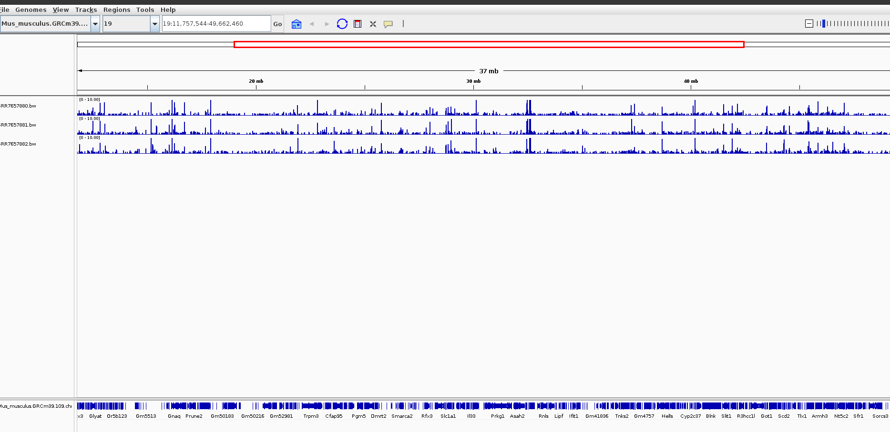
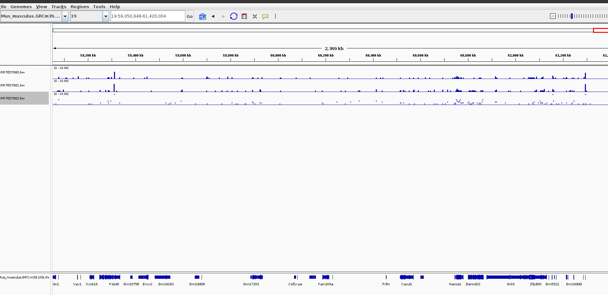

# RNA Seq

## Instructions

Your submission should include a readme, a makefile, and a design file.

You may re-use code and genomes from your previous submission. You will need a genome and a GTF/GFF annotation reference. You may also perform a transcriptome-based quantification if you choose.

For your genome of interest, find RNA-Seq data at SRA. Most RNA-Seq projects include multiple datasets.

Select at least three SRR datasets from the same project.

Write code to perform an RNA-Seq analysis on each dataset. The final result of your code should be a count matrix that summarizes read counts for each dataset.

Include screenshots from IGV that prove that your data is indeed RNA-Seq data. 

Discuss a few lines of the resulting count matrix. Visually identify rows where the counts show consistent gene expression levels.

## Assignment

I created two makefiles:

- process.mk: handles a specific SRA ID and produces a bam and a big wig file.
- Makefile: orchestrates using GNU parallel the production of multiple bam and big wig file from a transcriptomic study.

For this assignment, I used the chromosome 19 mouse genome, which you can download ensembl as follows:

```
wget -q -P refs/ https://ftp.ensembl.org/pub/release-109/fasta/mus_musculus/dna/Mus_musculus.GRCm39.dna.chromosome.19.fa.gz
```

Also, I downloaded the GTF file, and kept only the entries that start with 19 using grep command:

```
wget -q -P gtf/ https://ftp.ensembl.org/pub/release-109/gtf/mus_musculus/Mus_musculus.GRCm39.109.chr.gtf.gz
```

### Transcriptomics

To perform RNAseq, I used bioproject PRJNA483261 from the study `Transcriptomics Analysis of The Mouse Brain During Acute and Chronic Infection With T. gondii Oocysts`. 

You can find all experiments here:

[exp](https://www.ncbi.nlm.nih.gov/Traces/study/?acc=SRP156616&o=acc_s%3Aa)

I limited myself to the following three experiments:

```
SRR7657880
SRR7657881
SRR7657882
```

due to computational limitations. Furthermore, because I just want it to test the pipeline, you may notice that I have
incorrectly mapped SRR7657882, since this is the wrong control for the first two experiments, but for purposes 
of demonstration, I will overlook it.

I downloaded the raw reads using prefetch and fasterq-dump --split-files command.

This results in the following read directory:

```
du -sh full_reads/*
12G	full_reads/SRR7657880_1.fastq
12G	full_reads/SRR7657880_2.fastq
12G	full_reads/SRR7657881_1.fastq
12G	full_reads/SRR7657881_2.fastq
15G	full_reads/SRR7657882_1.fastq
15G	full_reads/SRR7657882_2.fastq
```

Because the datasets are a bit large, I kept only the first 400_000 raw reads. Thus, I created the limited reads/ directory:

```
du -sh reads/*
4.4M	reads/SRR7657880_1.fastq
4.4M	reads/SRR7657880_2.fastq
4.4M	reads/SRR7657881_1.fastq
4.4M	reads/SRR7657881_2.fastq
4.4M	reads/SRR7657882_1.fastq
4.4M	reads/SRR7657882_2.fastq
```

I created index using:

```
make -f src/run/hisat2.mk index REF=refs/Mus_musculus.GRCm39.dna.chromosome.19.fa
```

and I received an output:
```
Total time for call to driver() for forward index: 00:02:23
# hisat2 index: refs//idx/Mus_musculus.GRCm39.dna.chromosome.19.fa
```

### HiSat2

My design file looked like this:

```
sample,group
SRR7657880,infected
SRR7657881,infected
SRR7657882,control
```

Now that the design file is ready, I generated the process.mk which receives as an input:

- The reference genome path
- the R1 (first read pair)
- the R2 (second read pair)

and produces a bam and big wig file.

To parallelize and automate this procedure for multiple files, I generated a second makefile, named Makefile,
which now used GNU parallel to produce multiple bam and big wig files. In particular, the new Makefile,
provides two main rules:

- run: processes design.csv and produces bam and bigWig files.
- count: counts in parallel all the results from the run step.

For more information, please check out the provided scripts.

I ran it as follows:

```
make all DESIGN=design.csv
```

The resulting count.txt looks like this:

```
 Program:featureCounts v1.5.3; Command:"featureCounts" "-a" "gtf/Mus_musculus.GRCm39.109.chr19.gtf" "-o" "counts.txt" "bam/SRR7657880.bam" "bam/SRR7657881.bam" "bam/SRR7657882.bam" 
Geneid	Chr	Start	End	Strand	Length	bam/SRR7657880.bam	bam/SRR7657881.bam	bam/SRR7657882.bam
ENSMUSG00000077223	19	56265950	56266077	-	128	0	0	0
ENSMUSG00000044387	19;19	23112264;23112723	23112318;23113081	+;+	414	1	0	0
ENSMUSG00000033863	19;19;19;19	23118590;23121008;23142047;23142047	23119623;23121336;23145498;23142835	+;+;+;+	4815	41	45	42
```

Finally, I implemented one final rule: reformat, using the Rscript featurecounts.r, as follows:

```
reformat:
	Rscript src/r/format_featurecounts.r -c counts.txt -o $(COUNTS_RE)
```

and integrated this into all. After running the reformat rule, the counts look like this:

```
head counts.reformed.txt 
```

which displayed:

```
name,gene,SRR7657880,SRR7657881,SRR7657882
ENSMUSG00000077223,ENSMUSG00000077223,0,0,0
ENSMUSG00000044387,ENSMUSG00000044387,1,0,0
ENSMUSG00000033863,ENSMUSG00000033863,41,45,42
ENSMUSG00000080626,ENSMUSG00000080626,0,0,0
```
As far as, the question, Visually identify rows where the counts show consistent gene expression levels, I can see that for instance, the second row from the 
chunk provided below displays consistent levels (the control is also different so it definitely affects - as stated in the beginning).

```
ENSMUSG00000117958,ENSMUSG00000117958,0,0,0
ENSMUSG00000025203,ENSMUSG00000025203,114,181,265
ENSMUSG00000093315,ENSMUSG00000093315,0,0,0
ENSMUSG00000117957,ENSMUSG00000117957,0,0,2
ENSMUSG00000050195,ENSMUSG00000050195,1,1,0
ENSMUSG00000037071,ENSMUSG00000037071,14,10,49
```

Since, the counts reformed matrix, is only 1400 rows, I compressed it and attach it for reference.

### Results in IGV


The final step was to visualize the three bigwig files that I generated:






Thank you <3

Nikol
