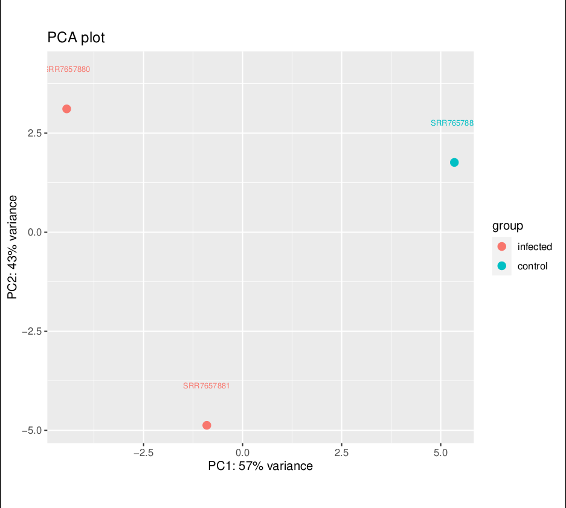

# RNA Seq

## Instructions

Your submission should include a readme, a makefile, and a design file.

You may re-use code and genomes from your previous submission.

Perform a differential expression analysis of a count matrix.

Take a count matrix, this count matrix may be one generated in a previous assignment or one that simulated.

Use method to identify genes/transcripts that show differential expression.

Draw a PCA plot and a heatmap for these genes.

Discuss the results. How many genes have you found. What kind of expression levels can you observe. How reliable does your data seem?

## WARNING! (Computational limitations)

PLEASE NOTE because I used three samples of Mus Musculus, 
this is only for demonstration purposes!!!

The final results do not depict reality (only three data points)!

## Assignment

In the previous Week I created two makefiles:

- process.mk: handles a specific SRA ID and produces a bam and a big wig file.
- Makefile: orchestrates using GNU parallel the production of multiple bam and big wig file from a transcriptomic study.

For this assignment, I used the chromosome 19 of the mouse genome, which you can download ensembl as follows:
```
wget -q -P refs/ https://ftp.ensembl.org/pub/release-109/fasta/mus_musculus/dna/Mus_musculus.GRCm39.dna.chromosome.19.fa.gz
```

Also, I downloaded the GTF file, and kept only the entries that start with 19 using grep command:
```
wget -q -P gtf/ https://ftp.ensembl.org/pub/release-109/gtf/mus_musculus/Mus_musculus.GRCm39.109.chr.gtf.gz
```

### Transcriptomics

To perform RNAseq, I used bioproject PRJNA483261 from the study `Transcriptomics Analysis of The Mouse Brain During Acute and Chronic Infection With T. gondii Oocysts`. 

You can find all experiments here:

[experiment-mouse](https://www.ncbi.nlm.nih.gov/Traces/study/?acc=SRP156616&o=acc_s%3Aa)

I limited myself to the following three experiments:

```
SRR7657880
SRR7657881
SRR7657882
```

due to computational limitations. Furthermore, because I just want it to test the pipeline, you may notice that I have
incorrectly mapped SRR7657882, since this is the wrong control for the first two experiments, but for purposes 
of demonstration, I will overlook it.


### Differential Expression Analysis

For the differential expression analysis I started from the files of Week 13.

I had generated the counts.txt for the mouse transcriptomics data. 
I downloaded the informative gene names for Mus musculus using:

```
Rscript src/r/create_tx2gene.r -d "mmusculus_gene_ensembl"
```

Finally, I created the counts.csv using these new gene names:

```
Rscript src/r/format_featurecounts.r -c counts.txt -t tx2gene.csv -o counts.csv
```

This is an example of how it looks like:
```
name,gene,SRR7657880,SRR7657881,SRR7657882
ENSMUSG00000077223,Gm22271,0,0,0
ENSMUSG00000044387,ENSMUSG00000044387,1,0,0
ENSMUSG00000033863,Klf9,41,45,42
```

I implemented this as a new rule in the Makefile of Week13.

Now I used deseq:

```
conda run -n stats Rscript src/r/deseq2.r -d design.csv \
                        -c counts.csv -o $(DESEQ) \
                        -s sample
```

which displayed:
```
name,gene,baseMean,baseMeanA,baseMeanB,foldChange,log2FoldChange,lfcSE,stat,PValue,PAdj,FDR,falsePos,SRR7657880,SRR7657881,SRR7657882
ENSMUSG00000046805,Mpeg1,28.5,41.8,1.9,0.045,-4.5,1.2,-3.74,1.9e-04,9.2e-02,0.0919,0,37.3,46.4,1.9
```

This was also added in the Makefile as a `deseq2` rule.

Finally, I implemented a new rule in the Makefile to generate the RNAseq plots from deseq outputs.

The plots were redirected in the `plots` directory.

PLEASE NOT because I used three samples, this is only for demonstration purposes!!!

Finally, these are the plots:




## THE END!

Thank you <3

Nikol
