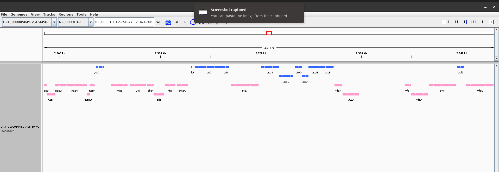
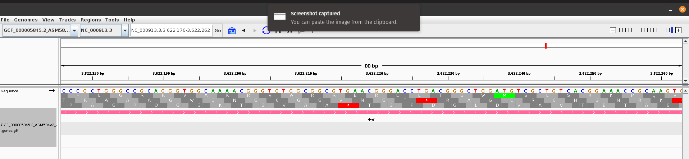
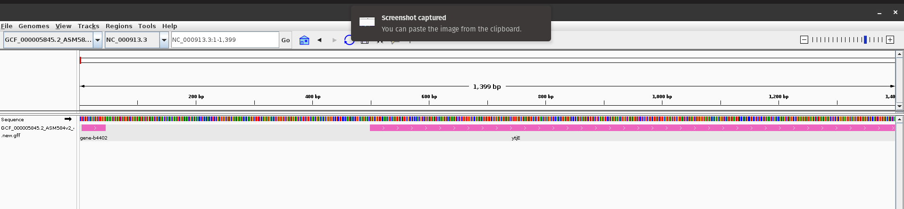

# Download, Generate and Visualize GFF files in IGV 


Organism Accession ID: GCF_000005845.2

GFF: GCF_000005845.2_ASM584v2_genomic.gff.gz 
FASTA: GCF_000005845.2_ASM584v2_genomic.gff.gz 

- Use IGV to visualize the annotations relative to the genome 


#### Organism 

Chosen organism: Escherichia coli

[coli](https://www.ncbi.nlm.nih.gov/datasets/genome/GCF_000005845.2/)

#### Download


```
wget https://ftp.ncbi.nlm.nih.gov/genomes/all/GCF/000/005/845/GCF_000005845.2_ASM584v2/GCF_000005845.2_ASM584v2_genomic.fna.gz  
wget https://ftp.ncbi.nlm.nih.gov/genomes/all/GCF/000/005/845/GCF_000005845.2_ASM584v2/GCF_000005845.2_ASM584v2_genomic.gff.gz  
```

#### Fetch genes from GFF File

```
awk -F '\t' ' $3 == "gene" { print $0 }' GCF_000005845.2_ASM584v2_genomic.gff > GCF_000005845.2_ASM584v2_genomic.genes.gff
```


#### Visualize in IGV 


I uploaded the fasta file from genomes dropdown and then uploaded the GFF file corresponding to E. Coli.

I chose different track colors for reverse and forward strand for the genes. 




#### Additional Nucleotide Zoom In 



#### Custom GFF File 


A custom GFF file was created:

```
GCF_000005845.2_ASM584v2_genomic.new.gff 
```

```
##gff-version 3
#!gff-spec-version 1.21
#!processor NCBI annotwriter
#!genome-build ASM584v2
#!genome-build-accession NCBI_Assembly:GCF_000005845.2
##sequence-region NC_000913.3 1 4641652
##species https://www.ncbi.nlm.nih.gov/Taxonomy/Browser/wwwtax.cgi?id=511145
NC_000913.3	RefSeq	gene	0 50 .	+	.	ID=gene-b4402;Dbxref=ASAP:ABE-0014437,ECOCYC:G7954,GeneID:948925;Name=yjjY;gbkey=Gene;gene=yjjY;gene_biotype=protein_coding;gene_synonym=ECK4394;locus_tag=b4402
NC_000913.3	RefSeq	CDS	5	45	.	+	0	ID=cds-NP_418819.1;Parent=gene-b4402;Dbxref=UniProtKB/Swiss-Prot:P0ADD9,GenBank:NP_418819.1,ASAP:ABE-0014437,ECOCYC:G7954,GeneID:948925;Name=NP_418819.1;gbkey=CDS;gene=yjjY;locus_tag=b4402;orig_transcript_id=gnl|b4402|mrna.NP_418819;product=uncharacterized protein YjjY;protein_id=NP_418819.1;transl_table=11
NC_000913.3	RefSeq	gene	100	100000	.	+	.	ID=gene-b4824;Dbxref=ECOCYC:G0-17098,GeneID:71004582;Name=ytjE;gbkey=Gene;gene=ytjE;gene_biotype=protein_coding;gene_synonym=ECK4681;locus_tag=b4824
NC_000913.3	RefSeq	CDS	500	90000	.	+	0	ID=cds-YP_010283921.1;Parent=gene-b4824;Dbxref=UniProtKB/Swiss-Prot:P0DV23,GenBank:YP_010283921.1,ECOCYC:G0-17098,GeneID:71004582;Name=YP_010283921.1;gbkey=CDS;gene=ytjE;locus_tag=b4824;orig_transcript_id=gnl|b4824|mrna.CDS4637;product=protein YtjE;protein_id=YP_010283921.1;transl_table=11
###
```

Four genomic features genes & CDS were created for the underlying organism using random coordinates.

The result on IGV:


