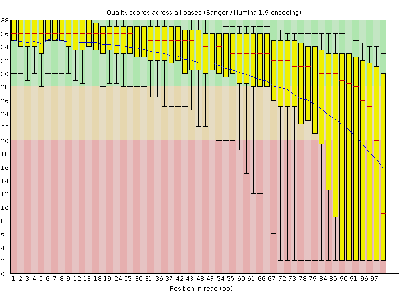
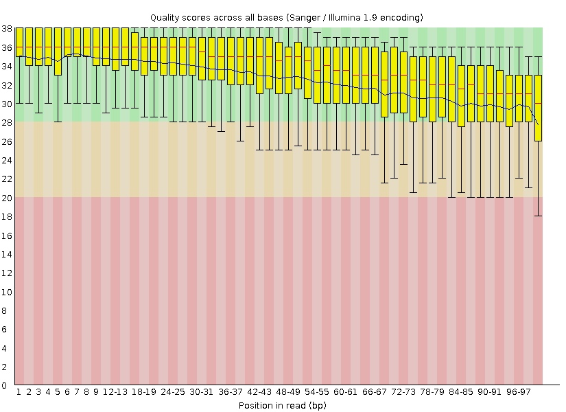

# Week 6

Write a script that downloads data from the SRA Links to an external site. or ENA
database and performs a quality control analysis on the data.

Identify a bad sequencing dataset. You may need to evaluate multiple SRR numbers to find one with poor quality.

I have chosen the following with bad quality reads:

```
SRR=SRR1608609
```

I don't think its part of a publication. All I could find is the following information:

- Bioproject: TPRJNA41223
- SRA Study: SRP001294	
- Title: Whole genome sequencing of (GBR) British from England and Scotland HapMap population

The SRR provided above can be found here:

[SRR](https://trace.ncbi.nlm.nih.gov/Traces/index.html?view=run_browser&acc=SRR062634&display=metadata)


After installing fastq-dump I run the following commands to download 1000 read pairs 
and dump them into the reads directory. Write a script to download data from the SRA database.

```
fastq-dump -X 1000 -F --outdir reads --split-files ${SRR}
```

- Evaluate the quality of the downloaded data.

We will evaluate the quality of the downloaded data using fastqc.

```
fastqc -q -o ${PDIR} ${R1} ${R2}
```


We note that the quality of the data are displayed below:



- Improve the quality of the reads in the dataset.

We will use fastp to improve the quality by trimming and using the adapter sequence:

```
fastp --adapter_sequence=${ADAPTER} --cut_tail \
      -i ${R1} -I ${R2} -o ${T1} -O ${T2} 
```

- Evaluate the quality again and document the improvements.


Rerun fastqc on the trimmed dataset 

```
fastqc -q -o ${PDIR} ${T1} ${T2}
```

leads to the following figure:



We note that the quality has improved substantially on the tail.
