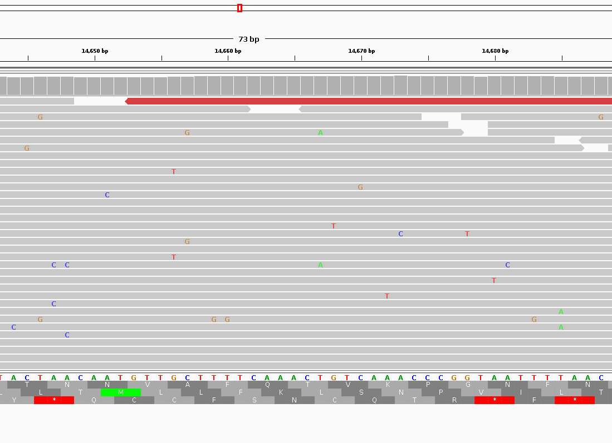

# Week 8

I will build on the README of the previous week.

I downloaded the following SRR:

```
https://www.ncbi.nlm.nih.gov/sra/SRR15829420
```

It's Whole Genome Sequencing of SARS COVID-2 using Illumina MiniSeq reads.

The bioproject is the following:
```
PRJNA741723
```

The sample is the Delta variant in Bangladeshi sample.

We will align this to the reference genome of SARS COVID-2 with the following accession ID:

## Introduction

This Makefile combines read simulation, downloading, trimming, and quality control into a single pipeline. It uses `fastp` for trimming reads and `FastQC` for quality checks, and summarizes the results with `MultiQC`.

The reference genome for SARS COVID-2 is the following:

```
NC_045512.2
```

For information about the taxonomy can be found here:

[link](https://www.ncbi.nlm.nih.gov/Taxonomy/Browser/wwwtax.cgi?id=2697049)

This is a special viral genome which we can download with:

```
datasets download virus genome accession ${ACC}
```

### Targets

- **usage**: Prints the help message, showing available targets.
- **genome**: Downloads the genome file from Ensembl.
- **simulate**: Simulates paired-end reads using `wgsim`.
- **download**: Downloads reads from SRA.
- **trim**: Trims reads using `fastp` with adapter sequence trimming.
- **fastqc**: Runs `FastQC` on the trimmed reads.
- **multiqc**: Runs `MultiQC` to aggregate the FastQC reports.
- **index**: Runs `BWA index` to index the reference genome
- **align**: Runs `bwa mem` to align reads to fastq and finally we index the alignment using samtools

### How to Use

To use the Makefile, run the following commands based on the task you want to perform:

```bash
make genome        # Download the genome
make simulate      # Simulate reads for the genome
make download      # Download reads from SRA
make trim          # Trim reads using fastp
make fastqc        # Run FastQC on trimmed reads
make multiqc       # Run MultiQC to summarize FastQC reports
make index         # Run BWA Index to Index Reference Genome
make align         # Align the Reads to Reference Genome and index using samtools
```

You can skip downloading the genome using `make genome`, since by directly using simulate command, the given genome will be downloaded automatically. 

```
make simulate
```

With `make download` we can download SRR reads. Finally, by using `make fastqc` we can trim the reads and finally generate a report using multiqc.


### Reports


### Visualization in IGV



I colored the negative reads in red color.

We can see that several reads have substitutions and probably some non-synonymous mutations alongside frameshits.
